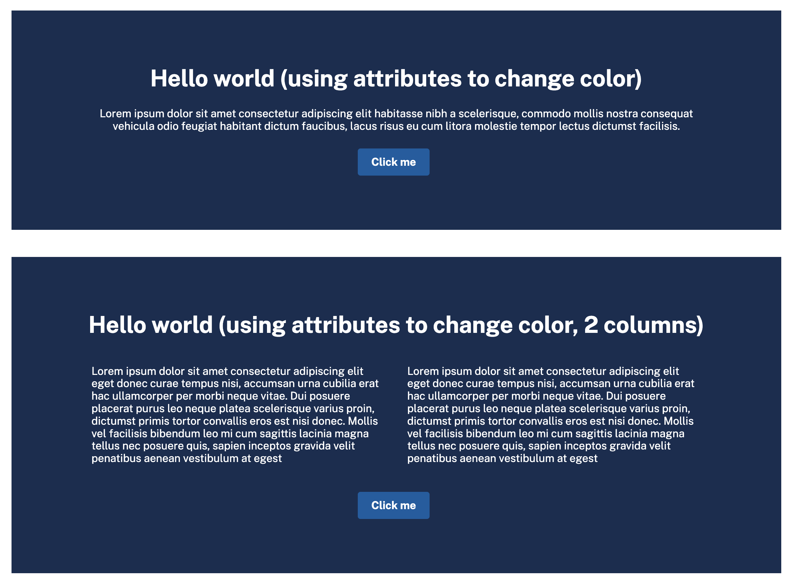

# Patterns training

## Starting

1. Clone repo
2. ddev start
3. During site install select 'existing config'
4. Follow theme setup in /themes/custom/ui_suite_daisyui_starterkit

## Useful resources

* https://www.drupal.org/docs/develop/theming-drupal/using-single-directory-components
* https://www.drupal.org/project/ui_patterns
* https://project.pages.drupalcode.org/ui_patterns/

## Task 1

I want you to create this has a component

### Getting started

1. Pick a random content type and add some fields for:
   1. Title
   2. Body
   3. Button
   4. A select with 3 colors (you pick)
2. In the node template call the componet you create

### Requirements

1. Based on the which color you pick apply an attribute class to the component.
   1. In the component attach a CSS file for the classes you come up with.
2. If button isn't supplied don't render button
3. Should be fully in the component, 0 outside css or js. Only twig you edit
   outside the component is the node.html.twig
   1. Any default classes like centering should be in the component twig.

